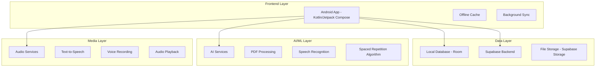

# Hulaba Learning App - Technical Architecture Document

## 1. Architecture Overview



## 2. Technology Stack

### Frontend
- **Language**: Kotlin
- **UI Framework**: Jetpack Compose
- **Architecture**: MVVM with Clean Architecture
- **Dependency Injection**: Hilt
- **Navigation**: Jetpack Navigation Compose
- **Local Database**: Room with Kotlin Coroutines
- **Background Work**: WorkManager
- **Image Loading**: Coil
- **Audio**: ExoPlayer + MediaRecorder

### Backend (Supabase)
- **Database**: PostgreSQL
- **Authentication**: Supabase Auth
- **File Storage**: Supabase Storage
- **Real-time**: Supabase Realtime
- **Edge Functions**: For AI processing
- **API Layer**: Supabase Client SDK

### AI/ML Services
- **PDF Processing**: ML Kit Text Recognition
- **Speech Recognition**: ML Kit Speech Recognition
- **Text Analysis**: OpenAI API (via Supabase Edge Functions)
- **Spaced Repetition**: Custom algorithm with ML optimization

## 3. Core Data Models

```mermaid
erDiagram
    USER ||--o{ USER_VOCABULARY : learns
    USER ||--o{ USER_TOPIC : studies
    USER ||--o{ LEARNING_SESSION : has
    USER ||--o{ ACHIEVEMENT : earns
    USER ||--o{ STUDY_GROUP : joins
    
    VOCABULARY ||--o{ USER_VOCABULARY : tracked_in
    VOCABULARY }o--|| VOCABULARY_CONTEXT : belongs_to
    VOCABULARY }o--|| CEFR_LEVEL : has_difficulty
    
    TOPIC ||--o{ CONCEPT : contains
    TOPIC ||--o{ USER_TOPIC : tracked_in
    TOPIC }o--|| TOPIC_CATEGORY : belongs_to
    TOPIC ||--o{ STUDY_MATERIAL : has
    
    CONCEPT ||--o{ CONCEPT_REVIEW : reviewed_in
    CONCEPT ||--o{ USER_NOTE : has_notes
    
    USER_VOCABULARY ||--o{ VOCABULARY_REVIEW : reviewed_in
    USER_TOPIC ||--o{ TOPIC_REVIEW : reviewed_in
    
    STUDY_MATERIAL ||--o{ MATERIAL_PAGE : contains
    STUDY_MATERIAL ||--o{ EXTRACTED_CONCEPT : generates
    
    USER ||--o{ STUDY_GROUP_MEMBER : participates
    STUDY_GROUP ||--o{ STUDY_GROUP_MEMBER : has_members
    STUDY_GROUP ||--o{ GROUP_DISCUSSION : has_discussions
    
    USER ||--o{ SHARED_COLLECTION : creates
    SHARED_COLLECTION ||--o{ COLLECTION_ITEM : contains
    SHARED_COLLECTION ||--o{ COLLECTION_DOWNLOAD : downloaded_by
```



### Detailed Entity Definitions

#### User Management
```sql
-- Users table
CREATE TABLE users (
    id UUID PRIMARY KEY DEFAULT gen_random_uuid(),
    email VARCHAR(255) UNIQUE NOT NULL,
    username VARCHAR(100) UNIQUE NOT NULL,
    avatar_url TEXT,
    german_level VARCHAR(10) DEFAULT 'A1' CHECK (german_level IN ('A1', 'A2', 'B1', 'B2', 'C1', 'C2')),
    target_german_level VARCHAR(10) DEFAULT 'C1',
    daily_mix_ratio_words INTEGER DEFAULT 60,
    daily_mix_ratio_topics INTEGER DEFAULT 40,
    preferred_session_length INTEGER DEFAULT 10,
    streak_count INTEGER DEFAULT 0,
    total_study_time_minutes INTEGER DEFAULT 0,
    words_learned_count INTEGER DEFAULT 0,
    topics_completed_count INTEGER DEFAULT 0,
    created_at TIMESTAMP WITH TIME ZONE DEFAULT NOW(),
    updated_at TIMESTAMP WITH TIME ZONE DEFAULT NOW(),
    last_study_date DATE,
    notification_enabled BOOLEAN DEFAULT true,
    offline_mode_enabled BOOLEAN DEFAULT true
);

-- User settings table
CREATE TABLE user_settings (
    id UUID PRIMARY KEY DEFAULT gen_random_uuid(),
    user_id UUID REFERENCES users(id) ON DELETE CASCADE,
    theme VARCHAR(20) DEFAULT 'auto' CHECK (theme IN ('auto', 'light', 'dark', 'oled')),
    font_size_scale FLOAT DEFAULT 1.0,
    animation_enabled BOOLEAN DEFAULT true,
    high_contrast_mode BOOLEAN DEFAULT false,
    color_blind_mode VARCHAR(20),
    speech_speed FLOAT DEFAULT 1.0,
    auto_play_pronunciation BOOLEAN DEFAULT true,
    speech_recognition_enabled BOOLEAN DEFAULT true,
    one_handed_mode BOOLEAN DEFAULT false,
    transit_mode_enabled BOOLEAN DEFAULT true,
    quiet_hours_start TIME,
    quiet_hours_end TIME,
    morning_start_time TIME DEFAULT '08:00',
    morning_end_time TIME DEFAULT '10:00',
    lunch_start_time TIME DEFAULT '12:30',
    lunch_end_time TIME DEFAULT '13:00',
    evening_start_time TIME DEFAULT '19:00',
    evening_end_time TIME DEFAULT '21:00'
);
```

#### Learning Content
```sql
-- Vocabulary words
CREATE TABLE vocabulary (
    id UUID PRIMARY KEY DEFAULT gen_random_uuid(),
    german_word VARCHAR(255) NOT NULL,
    english_translation VARCHAR(255) NOT NULL,
    example_sentence_german TEXT,
    example_sentence_english TEXT,
    part_of_speech VARCHAR(50),
    gender VARCHAR(10),
    plural_form VARCHAR(255),
    audio_url TEXT,
    difficulty_level VARCHAR(10) CHECK (difficulty_level IN ('A1', 'A2', 'B1', 'B2', 'C1', 'C2')),
    context_id UUID REFERENCES vocabulary_context(id),
    frequency_rank INTEGER,
    created_at TIMESTAMP WITH TIME ZONE DEFAULT NOW()
);

-- Vocabulary contexts
CREATE TABLE vocabulary_context (
    id UUID PRIMARY KEY DEFAULT gen_random_uuid(),
    name VARCHAR(100) NOT NULL,
    icon VARCHAR(50),
    color_hex VARCHAR(7),
    description TEXT
);

-- Topics
CREATE TABLE topics (
    id UUID PRIMARY KEY DEFAULT gen_random_uuid(),
    title VARCHAR(255) NOT NULL,
    description TEXT,
    category_id UUID REFERENCES topic_category(id),
    difficulty_level VARCHAR(10),
    estimated_study_time_minutes INTEGER,
    total_concepts_count INTEGER DEFAULT 0,
    cover_image_url TEXT,
    created_by UUID REFERENCES users(id),
    is_public BOOLEAN DEFAULT false,
    created_at TIMESTAMP WITH TIME ZONE DEFAULT NOW()
);

-- Topic categories
CREATE TABLE topic_category (
    id UUID PRIMARY KEY DEFAULT gen_random_uuid(),
    name VARCHAR(100) NOT NULL,
    icon VARCHAR(50),
    color_hex VARCHAR(7),
    description TEXT
);

-- Concepts within topics
CREATE TABLE concepts (
    id UUID PRIMARY KEY DEFAULT gen_random_uuid(),
    topic_id UUID REFERENCES topics(id) ON DELETE CASCADE,
    title VARCHAR(255) NOT NULL,
    description TEXT,
    definition TEXT,
    use_case TEXT,
    visual_diagram_url TEXT,
    code_example TEXT,
    german_translation TEXT,
    source_page_number INTEGER,
    order_index INTEGER,
    created_at TIMESTAMP WITH TIME ZONE DEFAULT NOW()
);

-- Study materials (PDFs, etc.)
CREATE TABLE study_materials (
    id UUID PRIMARY KEY DEFAULT gen_random_uuid(),
    topic_id UUID REFERENCES topics(id) ON DELETE CASCADE,
    title VARCHAR(255) NOT NULL,
    file_url TEXT NOT NULL,
    file_type VARCHAR(50) DEFAULT 'pdf',
    file_size_bytes BIGINT,
    page_count INTEGER,
    uploaded_by UUID REFERENCES users(id),
    created_at TIMESTAMP WITH TIME ZONE DEFAULT NOW()
);
```

#### Progress Tracking
```sql
-- User vocabulary progress
CREATE TABLE user_vocabulary (
    id UUID PRIMARY KEY DEFAULT gen_random_uuid(),
    user_id UUID REFERENCES users(id) ON DELETE CASCADE,
    vocabulary_id UUID REFERENCES vocabulary(id) ON DELETE CASCADE,
    status VARCHAR(20) DEFAULT 'new' CHECK (status IN ('new', 'learning', 'reviewing', 'mastered')),
    confidence_level INTEGER DEFAULT 0 CHECK (confidence_level BETWEEN 0 AND 5),
    last_reviewed_at TIMESTAMP WITH TIME ZONE,
    next_review_at TIMESTAMP WITH TIME ZONE,
    review_count INTEGER DEFAULT 0,
    correct_count INTEGER DEFAULT 0,
    incorrect_count INTEGER DEFAULT 0,
    is_favorite BOOLEAN DEFAULT false,
    created_at TIMESTAMP WITH TIME ZONE DEFAULT NOW(),
    UNIQUE(user_id, vocabulary_id)
);

-- User topic progress
CREATE TABLE user_topics (
    id UUID PRIMARY KEY DEFAULT gen_random_uuid(),
    user_id UUID REFERENCES users(id) ON DELETE CASCADE,
    topic_id UUID REFERENCES topics(id) ON DELETE CASCADE,
    status VARCHAR(20) DEFAULT 'not_started' CHECK (status IN ('not_started', 'in_progress', 'completed')),
    progress_percentage FLOAT DEFAULT 0,
    mastered_concepts_count INTEGER DEFAULT 0,
    total_concepts_count INTEGER DEFAULT 0,
    last_studied_at TIMESTAMP WITH TIME ZONE,
    next_review_at TIMESTAMP WITH TIME ZONE,
    started_at TIMESTAMP WITH TIME ZONE DEFAULT NOW(),
    completed_at TIMESTAMP WITH TIME ZONE,
    created_at TIMESTAMP WITH TIME ZONE DEFAULT NOW(),
    UNIQUE(user_id, topic_id)
);

-- Learning sessions
CREATE TABLE learning_sessions (
    id UUID PRIMARY KEY DEFAULT gen_random_uuid(),
    user_id UUID REFERENCES users(id) ON DELETE CASCADE,
    session_type VARCHAR(50) NOT NULL CHECK (session_type IN ('vocabulary_review', 'topic_review', 'mixed_review', 'speaking_practice', 'transit_mode')),
    duration_minutes INTEGER,
    items_reviewed_count INTEGER DEFAULT 0,
    correct_answers_count INTEGER DEFAULT 0,
    accuracy_percentage FLOAT,
    started_at TIMESTAMP WITH TIME ZONE DEFAULT NOW(),
    completed_at TIMESTAMP WITH TIME ZONE,
    device_type VARCHAR(50),
    location_context VARCHAR(50)
);

-- Vocabulary reviews
CREATE TABLE vocabulary_reviews (
    id UUID PRIMARY KEY DEFAULT gen_random_uuid(),
    user_vocabulary_id UUID REFERENCES user_vocabulary(id) ON DELETE CASCADE,
    session_id UUID REFERENCES learning_sessions(id) ON DELETE CASCADE,
    difficulty_rating INTEGER CHECK (difficulty_rating BETWEEN 1 AND 5),
    user_answer VARCHAR(255),
    correct_answer VARCHAR(255),
    was_correct BOOLEAN,
    time_spent_seconds INTEGER,
    reviewed_at TIMESTAMP WITH TIME ZONE DEFAULT NOW()
);

-- Concept reviews
CREATE TABLE concept_reviews (
    id UUID PRIMARY KEY DEFAULT gen_random_uuid(),
    user_id UUID REFERENCES users(id) ON DELETE CASCADE,
    concept_id UUID REFERENCES concepts(id) ON DELETE CASCADE,
    session_id UUID REFERENCES learning_sessions(id) ON DELETE CASCADE,
    difficulty_rating INTEGER CHECK (difficulty_rating BETWEEN 1 AND 5),
    confidence_before INTEGER CHECK (confidence_before BETWEEN 0 AND 5),
    confidence_after INTEGER CHECK (confidence_after BETWEEN 0 AND 5),
    time_spent_seconds INTEGER,
    reviewed_at TIMESTAMP WITH TIME ZONE DEFAULT NOW()
);
```

#### Community Features
```sql
-- Study groups
CREATE TABLE study_groups (
    id UUID PRIMARY KEY DEFAULT gen_random_uuid(),
    name VARCHAR(255) NOT NULL,
    description TEXT,
    category VARCHAR(100),
    language_level VARCHAR(10),
    max_members INTEGER DEFAULT 100,
    is_private BOOLEAN DEFAULT false,
    created_by UUID REFERENCES users(id),
    created_at TIMESTAMP WITH TIME ZONE DEFAULT NOW(),
    member_count INTEGER DEFAULT 0
);

-- Study group members
CREATE TABLE study_group_members (
    id UUID PRIMARY KEY DEFAULT gen_random_uuid(),
    group_id UUID REFERENCES study_groups(id) ON DELETE CASCADE,
    user_id UUID REFERENCES users(id) ON DELETE CASCADE,
    role VARCHAR(20) DEFAULT 'member' CHECK (role IN ('admin', 'moderator', 'member')),
    joined_at TIMESTAMP WITH TIME ZONE DEFAULT NOW(),
    is_active BOOLEAN DEFAULT true,
    UNIQUE(group_id, user_id)
);

-- Shared collections
CREATE TABLE shared_collections (
    id UUID PRIMARY KEY DEFAULT gen_random_uuid(),
    title VARCHAR(255) NOT NULL,
    description TEXT,
    collection_type VARCHAR(50) CHECK (collection_type IN ('vocabulary', 'topics', 'mixed')),
    created_by UUID REFERENCES users(id),
    is_public BOOLEAN DEFAULT true,
    download_count INTEGER DEFAULT 0,
    rating_average FLOAT DEFAULT 0,
    rating_count INTEGER DEFAULT 0,
    created_at TIMESTAMP WITH TIME ZONE DEFAULT NOW()
);

-- Collection items
CREATE TABLE collection_items (
    id UUID PRIMARY KEY DEFAULT gen_random_uuid(),
    collection_id UUID REFERENCES shared_collections(id) ON DELETE CASCADE,
    vocabulary_id UUID REFERENCES vocabulary(id) ON DELETE CASCADE,
    concept_id UUID REFERENCES concepts(id) ON DELETE CASCADE,
    order_index INTEGER,
    added_at TIMESTAMP WITH TIME ZONE DEFAULT NOW()
);
```

## 4. API Definitions

### Authentication APIs
```
POST /api/auth/register
POST /api/auth/login
POST /api/auth/logout
POST /api/auth/refresh
GET  /api/auth/profile
PUT  /api/auth/profile
```

### Learning Content APIs
```
GET  /api/vocabulary
GET  /api/vocabulary/{id}
POST /api/vocabulary/{id}/review
GET  /api/topics
GET  /api/topics/{id}
POST /api/topics/{id}/progress
GET  /api/concepts/{id}
POST /api/concepts/{id}/review
```

### Progress APIs
```
GET  /api/progress/overview
GET  /api/progress/german
GET  /api/progress/topics
GET  /api/progress/analytics
GET  /api/sessions
POST /api/sessions/start
POST /api/sessions/end
```

### Community APIs
```
GET  /api/groups
POST /api/groups
GET  /api/groups/{id}/join
GET  /api/collections
POST /api/collections
GET  /api/collections/{id}/download
```

### AI Service APIs (via Supabase Edge Functions)
```
POST /api/ai/analyze-pdf
POST /api/ai/generate-questions
POST /api/ai/optimize-schedule
POST /api/ai/speech-feedback
POST /api/ai/recommendations
```

## 5. Background Services

### WorkManager Tasks
1. **Daily Review Scheduler**
   - Calculate optimal review times
   - Generate daily learning plan
   - Update notification schedule

2. **Progress Synchronizer**
   - Sync offline progress to cloud
   - Download new content
   - Update streak calculations

3. **AI Content Processor**
   - Process uploaded PDFs
   - Extract concepts and generate questions
   - Create German translations

4. **Community Updater**
   - Sync study group activities
   - Update shared collections
   - Process challenge progress

## 6. Security & Privacy

### Data Protection
- All user data encrypted at rest
- Secure API communications (HTTPS/TLS)
- GDPR compliance for EU users
- Anonymous analytics option
- Data export functionality

### Authentication
- Supabase Auth with JWT tokens
- Refresh token rotation
- Biometric authentication support
- Session management
- Account deletion support

### Privacy Controls
- Granular notification settings
- Data sharing preferences
- Anonymous mode option
- Local-only mode support
- Privacy policy compliance

## 7. Performance Optimization

### Caching Strategy
- Aggressive local caching of learning content
- Image and audio file caching
- Offline-first architecture
- Smart cache invalidation
- Progressive download for large files

### Database Optimization
- Indexed queries for fast lookups
- Pagination for large datasets
- Lazy loading for content
- Database compaction
- Query optimization

### Memory Management
- Image loading optimization
- Audio streaming instead of full download
- Background task limitations
- Memory leak prevention
- Garbage collection optimization

## 8. Testing Strategy

### Unit Testing
- Repository pattern testing
- ViewModel logic testing
- Utility function testing
- Data model validation

### Integration Testing
- API integration testing
- Database operation testing
- Background service testing
- Third-party service integration

### UI Testing
- Compose UI testing
- Navigation flow testing
- Accessibility testing
- Performance testing

### User Testing
- Learning effectiveness studies
- Usability testing
- Accessibility validation
- Performance benchmarking

This architecture provides a solid foundation for building the comprehensive Hulaba learning app with all the advanced features specified in the design documents.